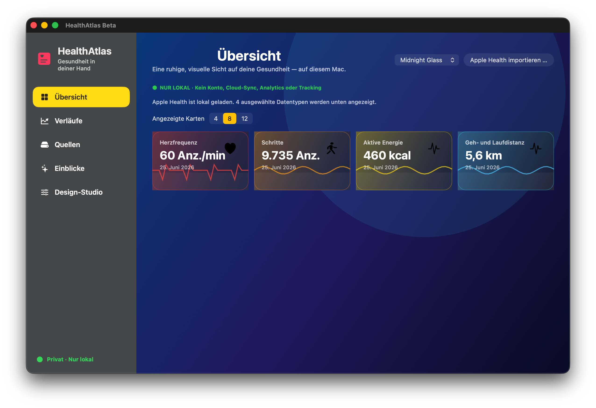
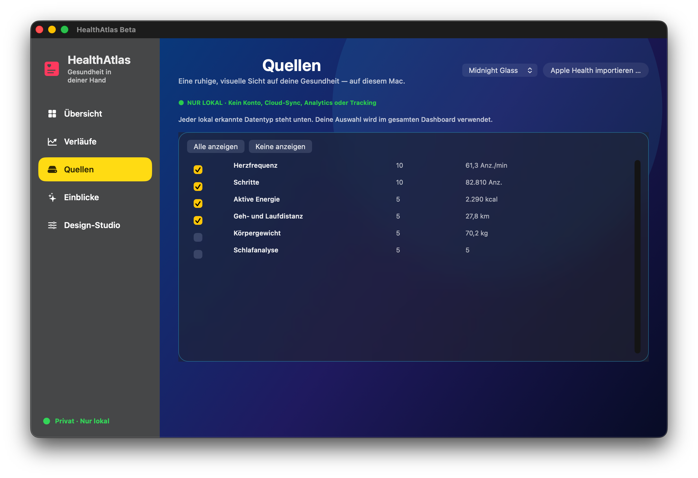
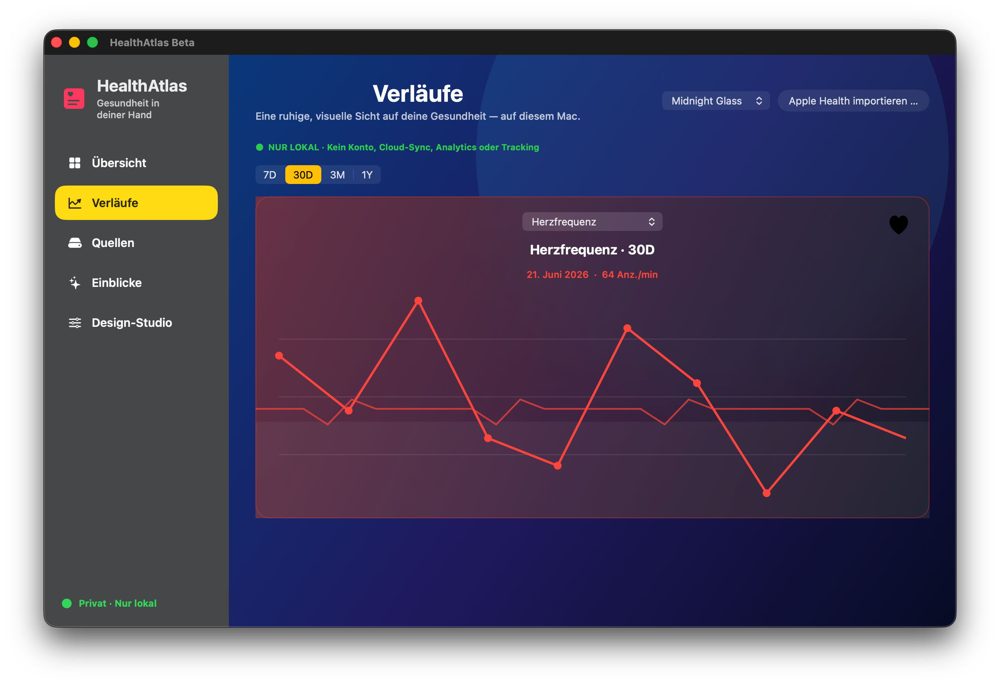
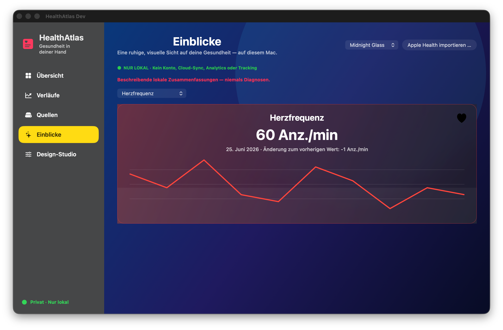
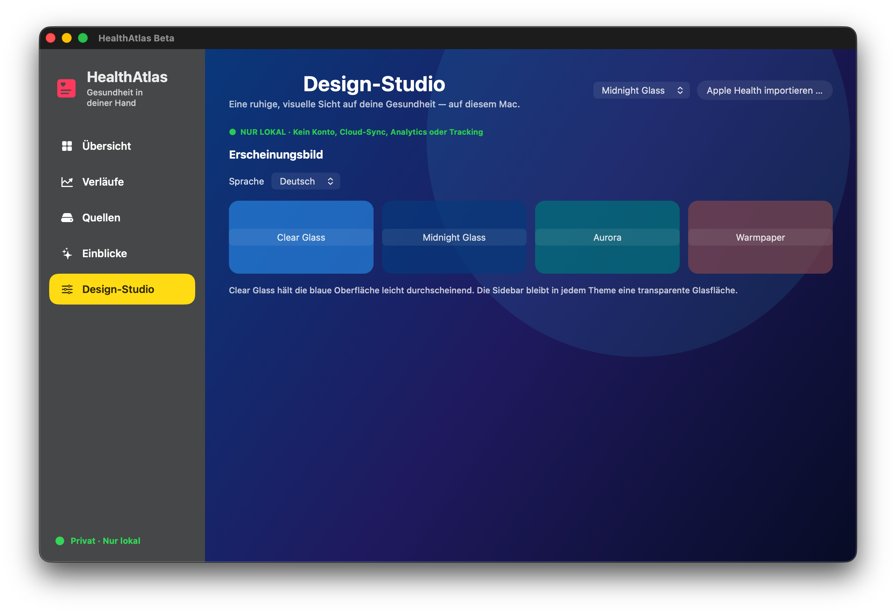

# HealthAtlas

HealthAtlas ist eine datenschutzorientierte macOS-App, die einen lokalen Apple-Health-Export verständlich und grafisch aufbereitet.

Die App startet leer, importiert ausschließlich eine vom Nutzer gewählte Datei und zeigt ausgewählte Gesundheitsdaten in einem ruhigen, modernen Dashboard. HealthAtlas konzentriert sich auf Verläufe und persönliche Muster statt auf Rohdaten-Tabellen.

## Was HealthAtlas bietet

- Native macOS-App mit Swift, SwiftUI und AppKit
- Lokaler Import von Apple-Health-`Export.xml`-Dateien und ZIP-Archiven damit
- Frei wählbare, erkannte Datentypen für die Anzeige
- Dynamische Kennzahlen-Kacheln mit eigener Farbe und grafischem Hintergrund
- Interaktive Verläufe: Datentyp, 7T/30T/3M/1J und einzelne Datenpunkte auswählen
- Beschreibende lokale Einblicke, niemals Diagnosen oder Behandlungsempfehlungen
- Deutsche und englische Oberfläche
- Glass-Themes, dezente Karten-/Diagramm-Animationen und native Milchglas-Sidebar

## Datenschutz an erster Stelle

HealthAtlas ist für lokale Verarbeitung ausgelegt. Persönliche Gesundheitsdaten sollen auf dem Mac des Nutzers bleiben. Das Projekt verwendet keine Analyse, Werbung, Nachverfolgung oder versteckten Cloud-Upload.

Das Projekt enthält weder Analytics, Werbung, Tracking, Konto noch Cloud-Upload. Importierte Daten bleiben nur für die laufende App-Sitzung im Speicher; beim nächsten Öffnen startet die App wieder leer.

## Lokale Builds und Gatekeeper

Die aktuellen Dev- und Beta-Builds sind ad hoc signiert, weil für das Projekt
kein Apple-Developer-Account vorhanden ist. macOS Gatekeeper zeigt beim ersten
Öffnen daher einen Hinweis an.

So öffnest du einen lokalen Build, ohne Gatekeeper systemweit abzuschalten:

1. Im Finder bei gedrückter Control-Taste auf `HealthAtlas Beta.app` (oder
   `HealthAtlas Dev.app`) klicken und
   **Öffnen** wählen.
2. Im Hinweisfenster nochmals **Öffnen** bestätigen.
3. Falls macOS die App weiter blockiert: **Systemeinstellungen → Datenschutz &
   Sicherheit** öffnen und bei genau diesem HealthAtlas-Build **Dennoch
   öffnen** wählen.

Mach das nur bei einem Build, den du selbst erstellt oder vom offiziellen
HealthAtlas-GitHub-Release erhalten hast. Gatekeeper wird dadurch nicht
systemweit deaktiviert.

## Datenquellen

Apple-Health-ZIP-Archive mit `Export.xml` und direkte `Export.xml`-Dateien werden lokal gelesen; die klinische Zusatzdatei wird bewusst nicht importiert. Es gibt keine direkte HealthKit- oder Cloud-Anbindung.

## Demo ohne persönliche Daten

Für einen sicheren Test liegt eine vollständig synthetische Apple-Health-Datei im Repository: [`Demo/AppleHealthDemo/Export.xml`](Demo/AppleHealthDemo/Export.xml). Sie enthält fiktive Schritte, Herzfrequenz, Körpergewicht, aktive Energie, Geh-/Laufdistanz und Schlafanalyse über mehrere Tage.

In HealthAtlas **Apple Health importieren …** wählen und diese Datei öffnen. Unter **Quellen** Datentypen wählen, unter **Übersicht** die Kartenzahl festlegen und unter **Verläufe** Datentyp, Zeitraum und einzelne Punkte ausprobieren. Es werden keine persönlichen Daten benötigt oder hochgeladen.

## Sicher testen

Zum Testen liegt eine vollständig synthetische Demo bei:

1. HealthAtlas öffnen und **Apple Health importieren …** wählen.
2. [`Demo/AppleHealthDemo/Export.xml`](Demo/AppleHealthDemo/Export.xml) auswählen.
3. Unter **Quellen** die gewünschten Werte wählen.
4. Kacheln unter **Übersicht**, Punkte und Zeiträume unter **Verläufe** sowie Zusammenfassungen unter **Einblicke** erkunden.

## Screenshots

### Übersicht



### Quellen



### Verläufe



### Einblicke



### Design-Studio



## Beta-Pakete

Das Beta-Skript erzeugt lokal eine ad-hoc-signierte App sowie ZIP, DMG und
SHA-256-Dateien, legt sie lokal ab und veröffentlicht einen GitHub-Pre-Release.

```bash
bash Scripts/create-beta-from-dev.sh
```

Die App liegt danach unter `dist/releases/beta/<version>/`; ZIP, DMG,
Prüfsummen und Changelog unter `Backup/releases/beta/<version>/`.

## Projektstatus

HealthAtlas ist eine frühe Beta. Testdaten, Oberfläche und lokaler Import sind
bereit für Feedback; medizinische Integration, Diagnosefunktionen und eine
öffentliche Verteilung sind ausdrücklich nicht Teil dieses Standes.

## Lizenz

Die Lizenz wird vor der ersten öffentlichen Veröffentlichung ergänzt.
