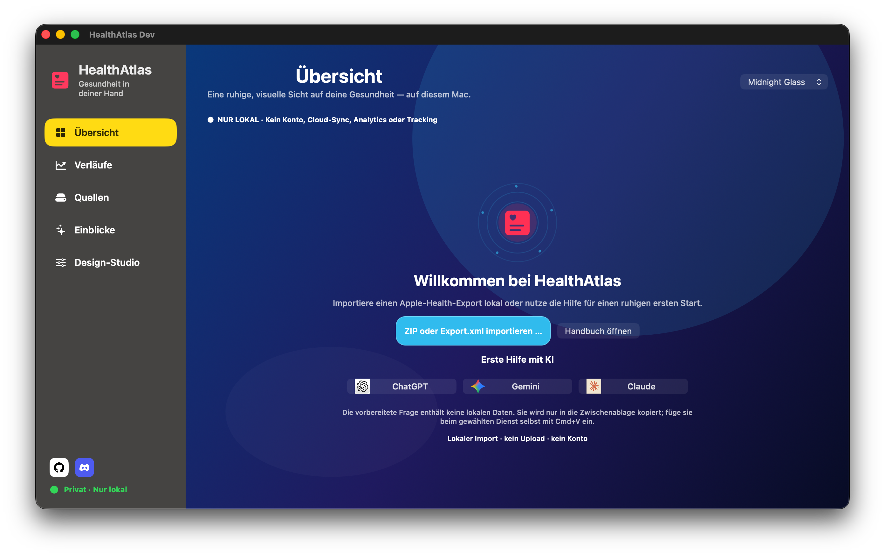
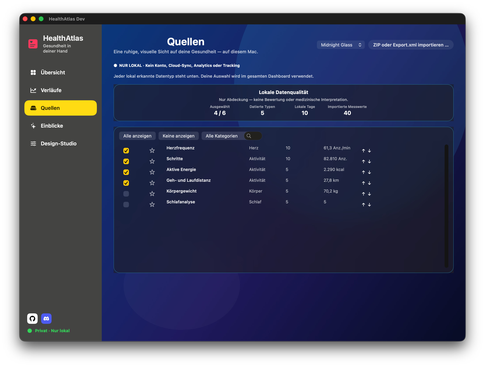
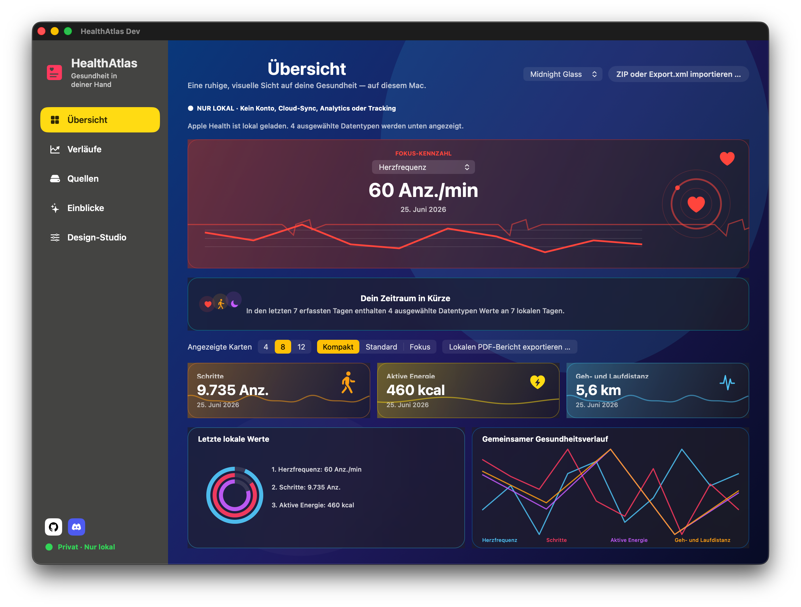
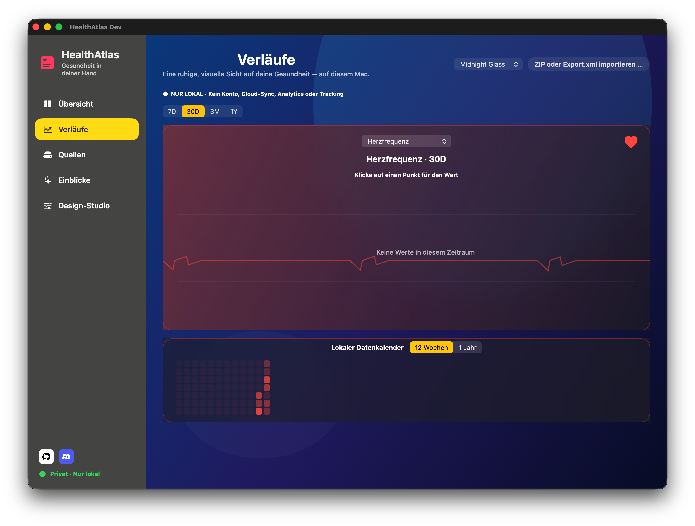
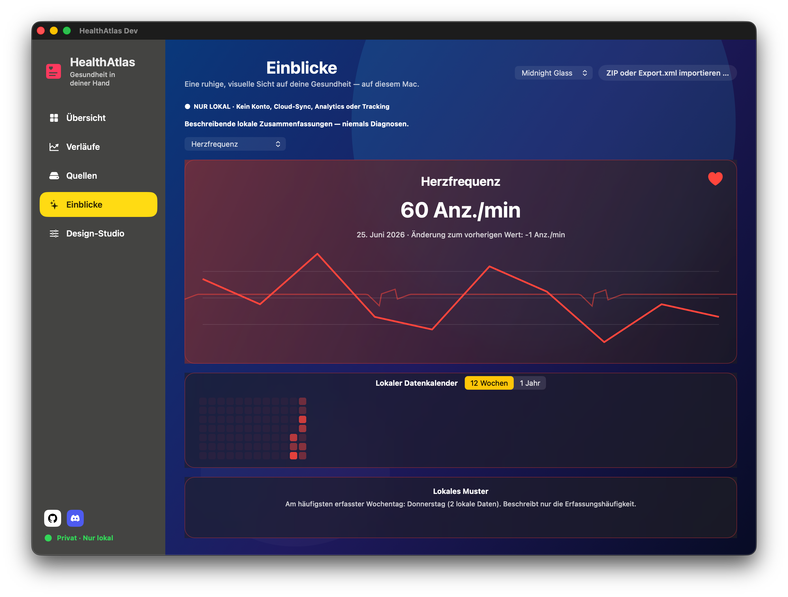
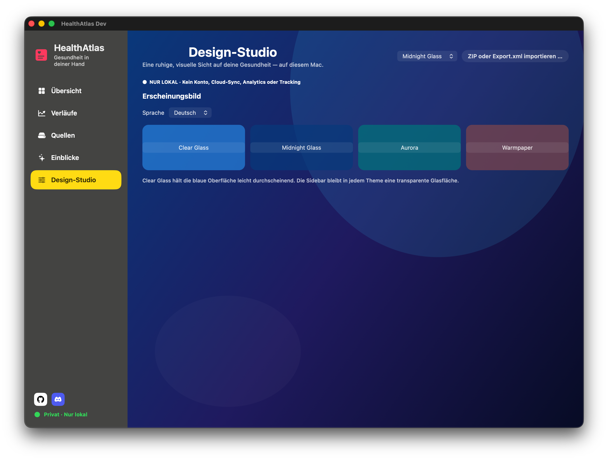

# HealthAtlas

HealthAtlas ist eine datenschutzorientierte macOS-App, die einen lokalen Apple-Health-Export verständlich und grafisch aufbereitet.

Die App startet leer, importiert ausschließlich eine vom Nutzer gewählte Datei und zeigt ausgewählte Gesundheitsdaten in einem ruhigen, modernen Dashboard. HealthAtlas konzentriert sich auf Verläufe und persönliche Muster statt auf Rohdaten-Tabellen.

## Funktionen

- Lokale Apple-Health-`Export.xml`-Dateien oder ZIP-Archive importieren und erkannte Datentypen gezielt auswählen.
- Anpassbare Übersicht mit Kennzahlen-Kacheln, gemeinsamem Verlauf, Zeitraum-Ringen und lokalem PDF-Bericht.
- Einzelne Werte in interaktiven Verläufen für 7T, 30T, 3M und 1J verfolgen, mit Punktdetails und lokalem Datenkalender.
- Eine Kennzahl in einer eigenen Vollbild-Fokusansicht mit lokalem Verlauf und Zeitraumvergleich öffnen.
- Beschreibende lokale Momentaufnahme, Abdeckung und Erfassungsmuster ohne Diagnose oder Gesundheitsbewertung lesen.
- Getrennte Pins und lokale Reihenfolge für Übersicht, Verläufe und Einblicke festlegen.
- Deutsche oder englische Oberfläche und eines von vier Glass-Themes wählen.

Die vollständige, nach Bereichen gegliederte [Funktionsübersicht](FEATURES.de.md) enthält die Details.

### Screenshots

Alle Screenshots zeigen die aktuelle HealthAtlas-Oberfläche mit ausschließlich synthetischen Demodaten; persönliche Gesundheitsdaten sind nicht zu sehen.

<a href="Screenshots/import.png"></a>
<a href="Screenshots/sources.png"></a>

<a href="Screenshots/overview.png"></a>
<a href="Screenshots/trends.png"></a>

<a href="Screenshots/insights.png"></a>
<a href="Screenshots/design-studio.png"></a>

## Datenschutz an erster Stelle

HealthAtlas ist für lokale Verarbeitung ausgelegt. Persönliche Gesundheitsdaten sollen auf dem Mac des Nutzers bleiben. Das Projekt verwendet keine Analyse, Werbung, Nachverfolgung oder versteckten Cloud-Upload.

Das Projekt enthält weder Analytics, Werbung, Tracking, Konto noch Cloud-Upload. Importierte Daten bleiben nur für die laufende App-Sitzung im Speicher; beim nächsten Öffnen startet die App wieder leer.

## Lokale Builds und Gatekeeper

Den lokalen Dev-Build erstellst du mit:

```bash
bash Scripts/build-development.sh
```

Die einzige startbare Dev-App liegt anschließend unter `dist/local-test/HealthAtlas-Development/HealthAtlas Dev.app`.
Auch ein direkter Build oder Run des gemeinsamen Dev-Schemes in Xcode aktualisiert genau diese App.
Der Ordner `.build` ist ausschließlich der temporäre Compiler-Arbeitsbereich von Xcode, keine zweite App zum Öffnen.

Die aktuellen Dev- und Beta-Builds sind ad hoc signiert. macOS Gatekeeper kann
beim ersten Öffnen einen Hinweis anzeigen.

So öffnest du einen lokalen Build, ohne Gatekeeper systemweit abzuschalten:

1. Im Finder bei gedrückter Control-Taste auf `HealthAtlas Beta.app` (oder
   `HealthAtlas Dev.app`) klicken und
   **Öffnen** wählen.
2. Im Hinweisfenster nochmals **Öffnen** bestätigen.
3. Falls macOS die App weiter blockiert: **Systemeinstellungen → Datenschutz &
   Sicherheit** öffnen und bei genau diesem HealthAtlas-Build **Dennoch
   öffnen** wählen.

Mach das nur bei einem Build, den du selbst erstellt oder vom offiziellen
HealthAtlas-GitHub-Release erhalten hast. Gatekeeper wird dadurch nicht
systemweit deaktiviert.

## Datenquellen

Apple-Health-ZIP-Archive mit `Export.xml` und direkte `Export.xml`-Dateien werden lokal gelesen; die klinische Zusatzdatei wird bewusst nicht importiert. Es gibt keine direkte HealthKit- oder Cloud-Anbindung.

## Demo ohne persönliche Daten

Für einen sicheren Test liegt eine vollständig synthetische Apple-Health-Datei im Repository: [`Demo/AppleHealthDemo/Export.xml`](Demo/AppleHealthDemo/Export.xml). Sie enthält fiktive Werte für alle aktuell unterstützten, nicht veralteten Apple-Health-Exporttypen; persönliche Exportwerte werden nicht übernommen.

In HealthAtlas **Apple Health importieren …** wählen und diese Datei öffnen. Unter **Quellen** Datentypen wählen, unter **Übersicht** Kartenzahl und Dichte festlegen und unter **Verläufe** Datentyp, Zeitraum und einzelne Punkte ausprobieren. Es werden keine persönlichen Daten benötigt oder hochgeladen.

## Sicher testen

Zum Testen liegt eine vollständig synthetische Demo bei:

1. HealthAtlas öffnen und **Apple Health importieren …** wählen.
2. [`Demo/AppleHealthDemo/Export.xml`](Demo/AppleHealthDemo/Export.xml) auswählen.
3. Unter **Quellen** die gewünschten Werte wählen.
4. Kacheln, Mehrfach-Verlauf und Ringe unter **Übersicht**, Punkte und Zeiträume unter **Verläufe** sowie Abdeckung und Erfassungsmuster unter **Einblicke** erkunden.

## Beta-Pakete

Das Beta-Skript erzeugt lokal eine ad-hoc-signierte App sowie ZIP, DMG und
SHA-256-Dateien, legt sie lokal ab und veröffentlicht einen GitHub-Pre-Release.

```bash
bash Scripts/create-beta-from-dev.sh
```

Die App liegt danach unter `dist/releases/beta/<version>/`; ZIP, DMG,
Prüfsummen und Changelog unter `Backup/releases/beta/<version>/`.

## Projektstatus

HealthAtlas ist eine frühe Beta. Lokaler Import und Oberfläche sind bereit für
Feedback. Medizinische Integration, Diagnosen und Behandlungsempfehlungen bietet
die App nicht.

## Lizenz

HealthAtlas steht unter der [GNU General Public License v3.0](LICENSE).
