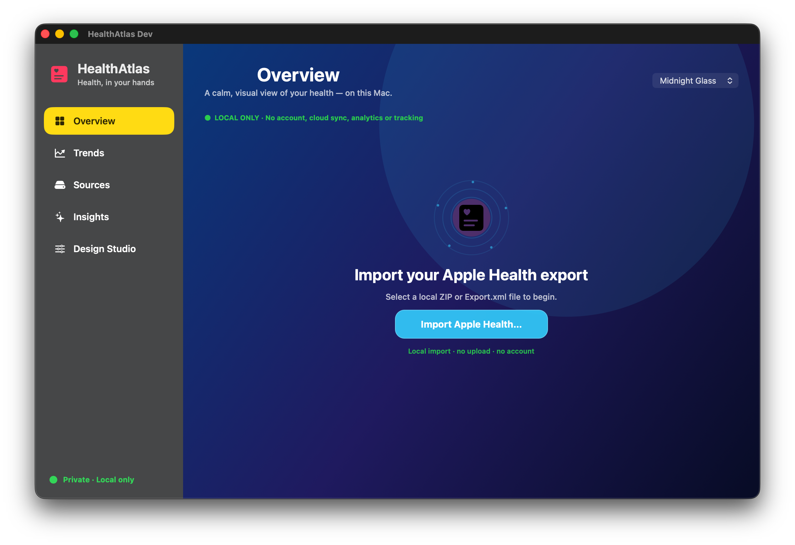

<p align="center">
  
</p>

<p align="center">
  <a href="README.de.md">🇩🇪 Deutsch</a>
</p>

# HealthAtlas

HealthAtlas is a privacy-first macOS app for turning a local Apple Health export into clear, visual insights.

It starts empty, imports only a file you choose, and turns selected health data into a calm, modern dashboard. HealthAtlas focuses on trends and personal patterns instead of raw tables.

## What HealthAtlas offers

- Native macOS app built with Swift, SwiftUI and AppKit
- Local import of Apple Health `Export.xml` files and ZIP archives containing one
- Select exactly which recognised data types appear in the app
- Responsive metric cards with individual colour and graphic treatments
- Interactive trends: select a data type, 7D/30D/3M/1Y range, and individual data points
- Descriptive local insights; never diagnoses or treatment recommendations
- German and English UI
- Glass themes, subtle card and chart animations, and a native frosted sidebar

## Privacy first

HealthAtlas is designed around local processing. Personal health data should remain on the user's Mac. The project does not include analytics, advertising, tracking or hidden cloud uploads.

The project contains no analytics, advertising, tracking, account or cloud upload. Imported data stays in memory for the current app session and the app opens empty again next time.

## Local builds and Gatekeeper

Create the local Dev app with:

```bash
bash Scripts/build-development.sh
```

The only runnable Dev output is `dist/local-test/HealthAtlas-Development/HealthAtlas Dev.app`.
The `.build` directory is only Xcode's temporary compiler workspace, not a second app to open.

The current Dev and Beta builds are ad-hoc signed because the project has no
Apple Developer account. macOS Gatekeeper will therefore show a warning the
first time one is opened.

To open a local build without disabling Gatekeeper system-wide:

1. In Finder, Control-click `HealthAtlas Beta.app` (or `HealthAtlas Dev.app`) and choose **Open**.
2. Confirm **Open** in the dialog.
3. If macOS still blocks it, open **System Settings → Privacy & Security** and
   choose **Open Anyway** for that specific HealthAtlas build.

Only do this for a build you created yourself or obtained from the official
HealthAtlas GitHub release. This does not disable Gatekeeper system-wide.

## Data sources

Apple Health ZIP archives containing `Export.xml` and direct `Export.xml` files
are read locally. The clinical companion file is intentionally not imported.
There is no direct HealthKit or cloud-service connection.

## Demo without personal data

The repository includes a fully synthetic Apple Health file for safe testing: [`Demo/AppleHealthDemo/Export.xml`](Demo/AppleHealthDemo/Export.xml). It contains fictional steps, heart rate, body mass, active energy, walking/running distance and sleep-analysis records across several days.

In HealthAtlas, choose **Import Apple Health…** and select that file. Use **Sources** to choose data types, **Overview** to select the card count, and **Trends** to try data types, periods and individual points. No personal data is required or uploaded.

## Try it safely

Use the included synthetic demo instead of personal data:

1. Open HealthAtlas and choose **Import Apple Health…**.
2. Select [`Demo/AppleHealthDemo/Export.xml`](Demo/AppleHealthDemo/Export.xml).
3. Choose the metrics under **Sources**.
4. Explore cards in **Overview**, point details and time ranges in **Trends**, and per-metric summaries in **Insights**.

## Screenshots

All screenshots below use the included synthetic demo data — no personal health data is shown.

### Import

<a href="Screenshots/import.png"></a>

### Overview

<a href="Screenshots/overview.png"></a>

### Sources

<a href="Screenshots/sources.png"></a>

### Trends

<a href="Screenshots/trends.png"></a>

### Insights

<a href="Screenshots/insights.png"></a>

### Design Studio

<a href="Screenshots/design-studio.png"></a>

## Beta packages

The beta script builds an ad-hoc-signed app plus ZIP, DMG and SHA-256 files,
stores them locally and publishes a GitHub pre-release.

```bash
bash Scripts/create-beta-from-dev.sh
```

The app is written to `dist/releases/beta/<version>/`; ZIP, DMG, checksums and
the changelog are written to `Backup/releases/beta/<version>/`.

## Project status

HealthAtlas is an early beta. Test data, interface and local-import behavior
are ready for feedback; medical integration, diagnosis features and public
distribution are explicitly out of scope.

## License

License information will be added before the first public release.
