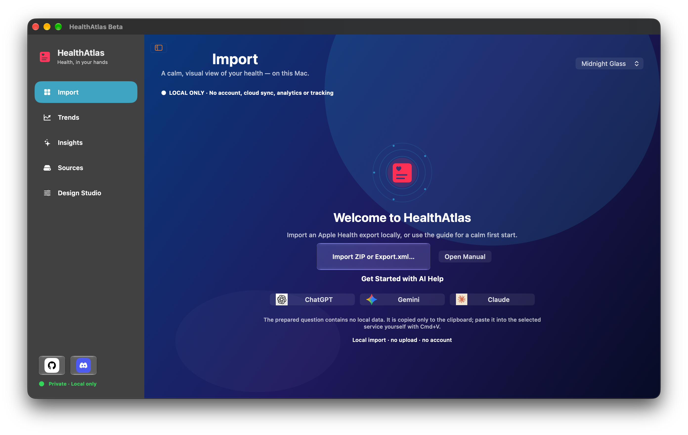
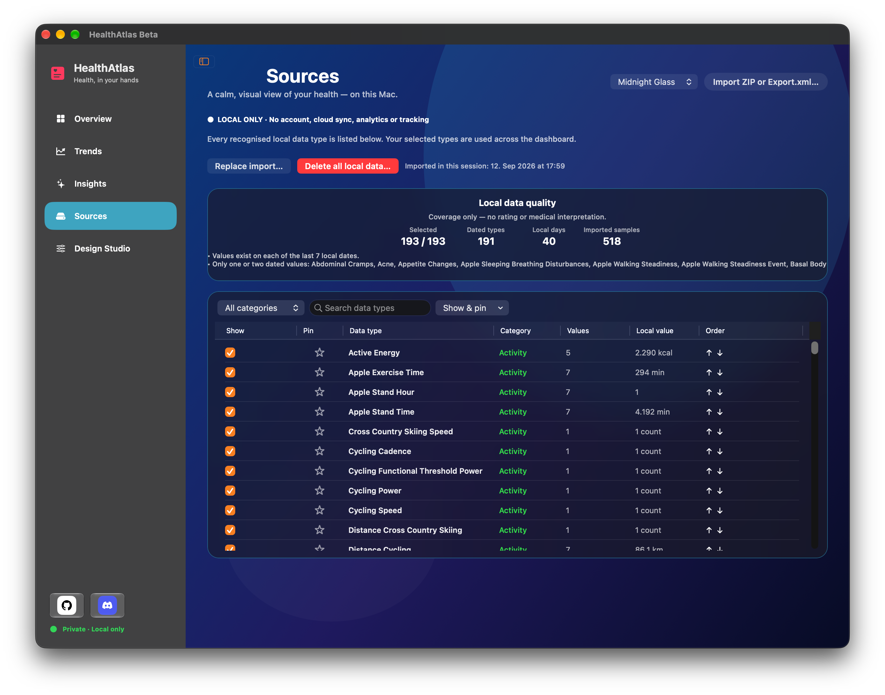
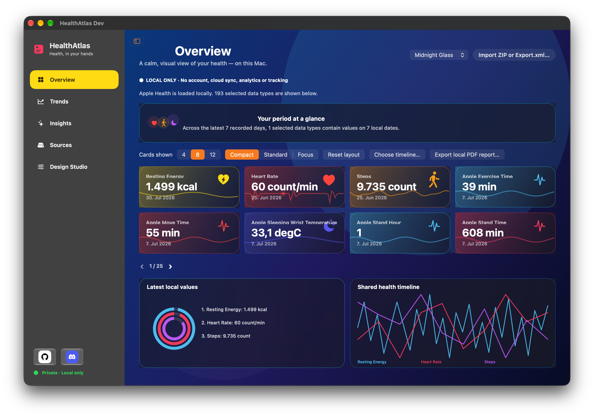
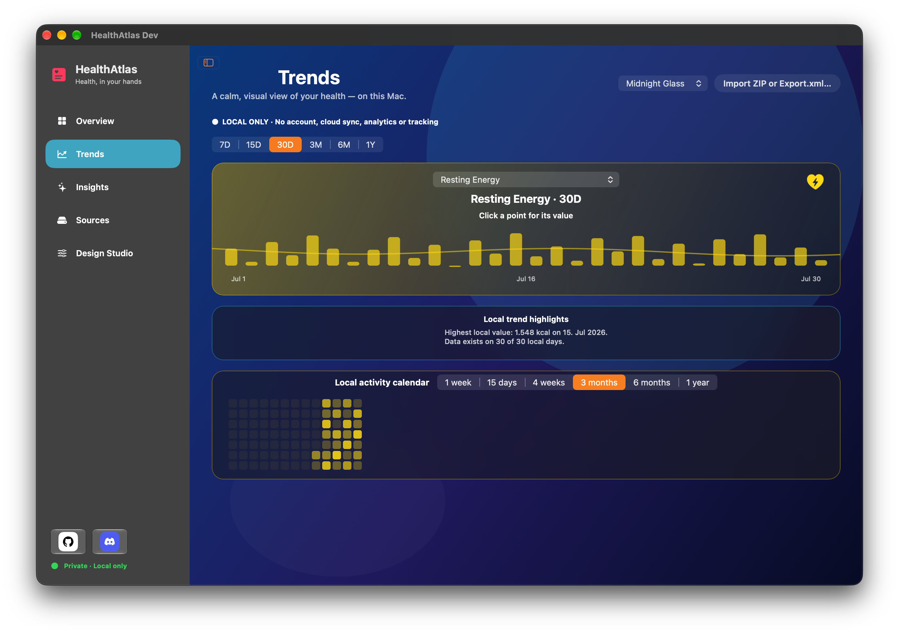
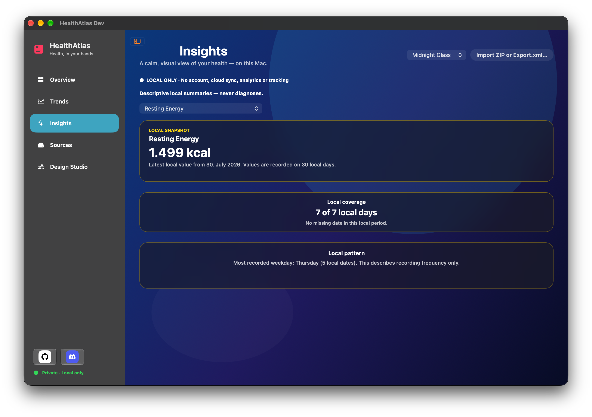
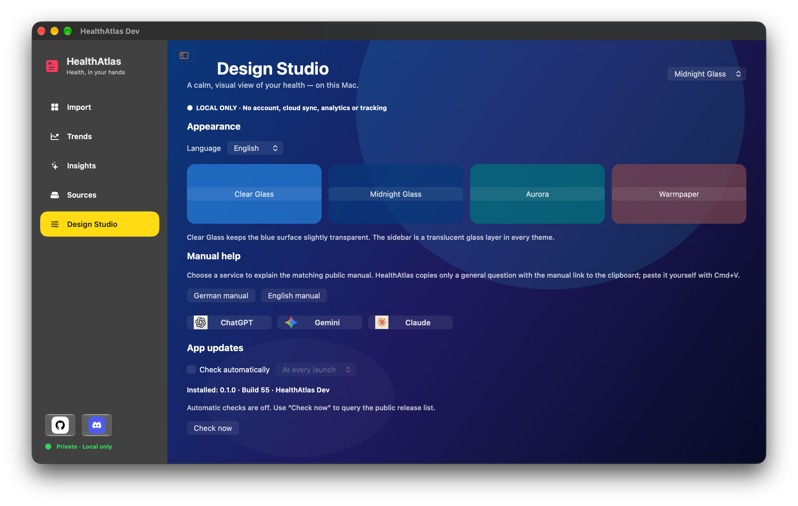

# HealthAtlas

[Deutsch](README.de.md)

HealthAtlas is a privacy-first macOS app for turning a local Apple Health export into clear, visual insights.

It starts empty, imports only a file you choose, and turns selected health data into a calm, modern dashboard. HealthAtlas focuses on trends and personal patterns instead of raw tables.

## What HealthAtlas offers

- Import a local Apple Health `Export.xml` file or ZIP archive and choose the recognised data types to show.
- Browse Sources by category or search, then keep separate pins and local ordering for Overview, Trends and Insights.
- Configure 4, 8 or 12 overview cards, their density and their local order.
- Choose one to four data types independently for the shared health timeline.
- Follow a selected metric across 7D, 15D, 30D, 3M, 6M and 1Y, with clickable points and a clickable local calendar.
- Compare the current period with the immediately preceding period and open a metric in a full-screen focus view.
- Read local snapshots, coverage and recording patterns without diagnoses or health ratings.
- Export a local PDF report with its own period, data-type and theme choices.
- Use German or English, choose from four glass themes, and check the public GitHub release list manually or on a selected schedule.
- Open either public manual separately, or let ChatGPT, Gemini or Claude explain the matching manual from a general copied prompt. No local health data is included.


### Screenshots

All screenshots show the current HealthAtlas interface with synthetic demo data only; no personal health data is shown.

<table>
  <tr><th align="left">Import</th><th align="left">Sources</th></tr>
  <tr>
    <td><a href="Screenshots/final-import.png"></a></td>
    <td><a href="Screenshots/final-sources.png"></a></td>
  </tr>
  <tr><th align="left">Overview</th><th align="left">Trends</th></tr>
  <tr>
    <td><a href="Screenshots/final-overview.png"></a></td>
    <td><a href="Screenshots/final-trends.png"></a></td>
  </tr>
  <tr><th align="left">Insights</th><th align="left">Design Studio</th></tr>
  <tr>
    <td><a href="Screenshots/final-insights.png"></a></td>
    <td><a href="Screenshots/final-design-studio.png"></a></td>
  </tr>
</table>

## Privacy first

HealthAtlas is designed around local processing. Personal health data should remain on the user's Mac. The project does not include analytics, advertising, tracking or hidden cloud uploads.

The project contains no analytics, advertising, tracking, account or cloud upload. Imported data stays in memory for the current app session and the app opens empty again next time. If you enable an update check, HealthAtlas requests only the public GitHub release list; it never includes health data.

## Local builds and Gatekeeper

Create the local Dev app with:

```bash
bash Scripts/build-development.sh
```

The only runnable Dev output is `dist/local-test/HealthAtlas-Development/HealthAtlas Dev.app`.
Building or running the shared Dev scheme directly in Xcode refreshes this same app.
The `.build` directory is only Xcode's temporary compiler workspace, not a second app to open.

Dev, Beta and Final builds are ad-hoc signed. macOS Gatekeeper may show a
warning the first time one is opened.

To open a local build without disabling Gatekeeper system-wide:

1. In Finder, Control-click `HealthAtlas.app`, `HealthAtlas Beta.app` or `HealthAtlas Dev.app` and choose **Open**.
2. Confirm **Open** in the dialog.
3. If macOS still blocks it, open **System Settings → Privacy & Security** and
   choose **Open Anyway** for that specific HealthAtlas build.

Only do this for a build you created yourself or obtained from the official
HealthAtlas GitHub release. This does not disable Gatekeeper system-wide.

## Data sources

Apple Health ZIP archives containing `Export.xml` and direct `Export.xml` files
are read locally. The clinical companion file is intentionally not imported.
There is no direct HealthKit or cloud-service connection.

## Demo without personal data

The repository includes a fully synthetic Apple Health file for safe testing: [`Demo/AppleHealthDemo/Export.xml`](Demo/AppleHealthDemo/Export.xml). It contains fictional values for every currently supported, non-deprecated Apple Health export type; no personal export values are included.

In HealthAtlas, choose **Import Apple Health…** and select that file. Use **Sources** to choose data types, **Overview** to select card count and density, and **Trends** to try data types, periods and individual points. No personal data is required or uploaded.

## Try it safely

Use the included synthetic demo instead of personal data:

1. Open HealthAtlas and choose **Import Apple Health…**.
2. Select [`Demo/AppleHealthDemo/Export.xml`](Demo/AppleHealthDemo/Export.xml).
3. Choose the metrics under **Sources**.
4. Explore cards, the shared timeline and rings in **Overview**, point details and time ranges in **Trends**, and coverage and recording patterns in **Insights**.

## Beta packages

The beta script builds an ad-hoc-signed app plus ZIP, DMG and SHA-256 files,
stores them locally and publishes a GitHub pre-release.

```bash
bash Scripts/create-beta-from-dev.sh
```

The app is written to `dist/releases/beta/<version>/`; ZIP, DMG, checksums and
the changelog are written to `Backup/releases/beta/<version>/`.

## Project status

Final 1.0.0 is the current stable release. HealthAtlas remains a local visualisation tool and does not provide medical integration, diagnoses or treatment recommendations.

## License

HealthAtlas is licensed under the [GNU General Public License v3.0](LICENSE).
